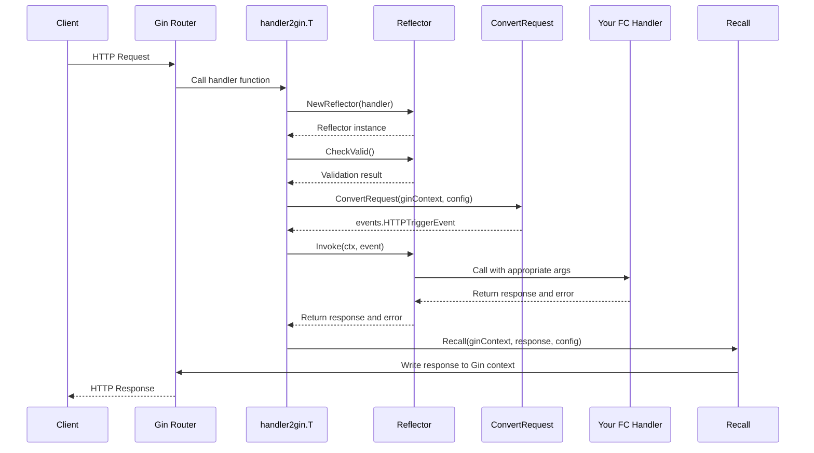

# fchandler2go

A Go library that adapts Alibaba Cloud Function Compute (FC) HTTP handlers to work with the Gin web framework. This allows you to write your handlers once in the FC style and use them in both FC environments and regular Gin web applications.

## Installation

```bash
go get github.com/danvei233/fchandler2go
```

## Features

- Convert Gin HTTP requests to Alibaba Cloud Function Compute HTTP trigger events
- Convert FC HTTP responses back to Gin responses
- Support for various input and output types
- Automatic validation of handler function signatures
- Support for base64 encoded request/response bodies

## Usage

### Basic Example

```go
package main

import (
    "github.com/aliyun/fc-runtime-go-sdk/events"
    "github.com/danvei233/fchandler2go"
    "github.com/gin-gonic/gin"
    "net/http"
)

func main() {
    router := gin.Default()

    // Register your FC-style handler with Gin
    router.Any("/*all", handler2gin.T(HandleRequest))

    router.Run(":8080")
}

// FC-style handler function
func HandleRequest(event events.HTTPTriggerEvent) (*events.HTTPTriggerResponse, error) {
    // Process the event

    // Return a response
    return &events.HTTPTriggerResponse{
        StatusCode: http.StatusOK,
        Headers: map[string]string{
            "Content-Type": "application/json",
        },
        Body: `{"message": "Hello, World!"}`,
        IsBase64Encoded: false,
    }, nil
}
```

### Advanced Example with Context

```go
package main

import (
    "context"
    "github.com/aliyun/fc-runtime-go-sdk/events"
    "github.com/danvei233/fchandler2go"
    "github.com/gin-gonic/gin"
    "net/http"
)

func main() {
    router := gin.Default()

    // Register your FC-style handler with Gin
    router.Any("/api/*path", handler2gin.T(HandleRequestWithContext))

    router.Run(":8080")
}

// FC-style handler function with context
func HandleRequestWithContext(ctx context.Context, event events.HTTPTriggerEvent) (*events.HTTPTriggerResponse, error) {
    // Use context if needed

    // Process the event

    // Return a response
    return &events.HTTPTriggerResponse{
        StatusCode: http.StatusOK,
        Headers: map[string]string{
            "Content-Type": "application/json",
        },
        Body: `{"message": "Hello with context!"}`,
        IsBase64Encoded: false,
    }, nil
}
```

### Configuration Options

```go
package main

import (
	"github.com/aliyun/fc-runtime-go-sdk/events"
	"github.com/danvei233/fchandler2go"
	"github.com/danvei233/fchandler2go/AliyunWebFC/config"
	"github.com/gin-gonic/gin"
)

func main() {
	router := gin.Default()

	// Configure the handler with options
	cfg := config.Config{
		Output: config.Output{
			RequestIDFromMock: true,
		},
	}

	router.Any("/*all", handler2gin.T(HandleRequest, cfg))

	router.Run(":8080")
}

func HandleRequest(event events.HTTPTriggerEvent) (*events.HTTPTriggerResponse, error) {
	// Handler implementation
	// ...
}
```

## Calling Process

The following diagram illustrates the calling process when using fchandler2go:



## Supported Handler Signatures

The library supports the following handler function signatures:

1. `func(events.HTTPTriggerEvent) (*events.HTTPTriggerResponse, error)`
2. `func(context.Context, events.HTTPTriggerEvent) (*events.HTTPTriggerResponse, error)`
3. `func() (*events.HTTPTriggerResponse, error)`
4. `func(context.Context) (*events.HTTPTriggerResponse, error)`

## License

[License information]
